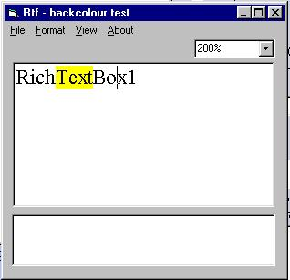



## Richtextbox \- new functionality

### Description

Show some new functionality of the Richtextbox control. Read the notes inside the program. Needs the new riched2.dll (version 3)and the Riched32.dll available from www.vbaccelerator.com (I include them with the program - you need to replace the windows\system files with these ). Thanks to Steve McMahon for his work which I gladly was influenced by. Vb5 needs to remove some of the vbp file keys. (Size of zip 454KB)
 
### More Info
 

             |
---                |---
**Submitted On**   |2000-07-29 22:14:52
**By**             |[oigres P](https://github.com/Planet-Source-Code/PSCIndex/blob/master/ByAuthor/oigres-p.md)
**Level**          |Advanced
**User Rating**    |4.8 (24 globes from 5 users)
**Compatibility**  |VB 4\.0 \(32\-bit\), VB 5\.0, VB 6\.0, VB Script, ASP \(Active Server Pages\) 
**Category**       |[VB function enhancement](https://github.com/Planet-Source-Code/PSCIndex/blob/master/ByCategory/vb-function-enhancement__1-25.md)
**World**          |[Visual Basic](https://github.com/Planet-Source-Code/PSCIndex/blob/master/ByWorld/visual-basic.md)
**Archive File**   |[CODE\_UPLOAD83797302000\.zip](https://github.com/Planet-Source-Code/oigres-p-richtextbox-new-functionality__1-9715/archive/master.zip)

